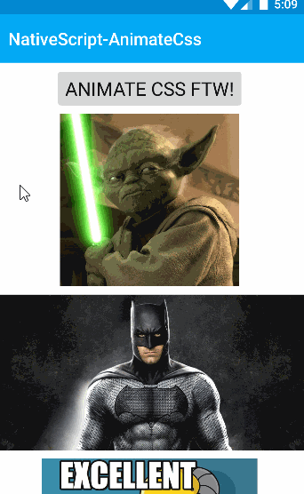

# NativeScript-AnimateCSS 
NativeScript plugin for Android to mimic Animate.CSS animations on Android views.

This plugin uses [AndroidViewAnimations](https://github.com/daimajia/AndroidViewAnimations) by [daimajia](https://github.com/daimajia)

### AnimateCSS Usage 



## Installation
`npm install nativescript-animatecss`

## Usage

### XML:
```XML
<Page xmlns="http://schemas.nativescript.org/tns.xsd" loaded="pageLoaded">
    <Page.actionBar>
    <ActionBar title="NativeScript-AnimateCss" color="#fff" backgroundColor="#03A9F4" />
  </Page.actionBar>
    <ScrollView>
        <StackLayout>
            <button text="Animate Css FTW!" tap="animateIt" />
            <image src="~/images/yoda.jpg" stretch="aspectFit" height="200" tap="flashIt" />
            <image src="~/images/batman.jpg" stretch="aspectFit" height="200" tap="rotateIn" />
            <image src="~/images/excellent.jpg" stretch="aspectFit" height="200" tap="rubberBand" />
        </StackLayout> 
    </ScrollView>
</Page>
```

### JS:
```JS
var animatecss = require("nativescript-animatecss");

function animateIt(args) {
    // get the native android widget for the view
    var nativeView = args.object.android;
    animatecss.animate({ view: nativeView, cssClass: 'Hinge', duration: 600 }).then(function (result) {
        console.log(result);
    }, function (err) {
        console.log(err);
    });
}
exports.animateIt = animateIt;
```


### API

- animate(options) 
 - **view** : native android view
 - **cssClass** : string class name
 - **duration**: int in milliseconds

### Effects
#### Attention
`Flash`, `Pulse`, `RubberBand`, `Shake`, `Swing`, `Wobble`, `Bounce`, `Tada`, `StandUp`, `Wave`

#### Special
`Hinge`, `RollIn`, `RollOut`,`Landing`,`TakingOff`,`DropOut`

#### Bounce
`BounceIn`, `BounceInDown`, `BounceInLeft`, `BounceInRight`, `BounceInUp`

#### Fade
`FadeIn`, `FadeInUp`, `FadeInDown`, `FadeInLeft`, `FadeInRight`

`FadeOut`, `FadeOutDown`, `FadeOutLeft`, `FadeOutRight`, `FadeOutUp`

#### Flip
`FlipInX`, `FlipOutX`, `FlipOutY`

#### Rotate
`RotateIn`, `RotateInDownLeft`, `RotateInDownRight`, `RotateInUpLeft`, `RotateInUpRight`

`RotateOut`, `RotateOutDownLeft`, `RotateOutDownRight`, `RotateOutUpLeft`, `RotateOutUpRight`

#### Slide
`SlideInLeft`, `SlideInRight`, `SlideInUp`, `SlideInDown`

`SlideOutLeft`, `SlideOutRight`, `SlideOutUp`, `SlideOutDown`

#### Zoom
`ZoomIn`, `ZoomInDown`, `ZoomInLeft`, `ZoomInRight`, `ZoomInUp`

`ZoomOut`, `ZoomOutDown`, `ZoomOutLeft`, `ZoomOutRight`, `ZoomOutUp`